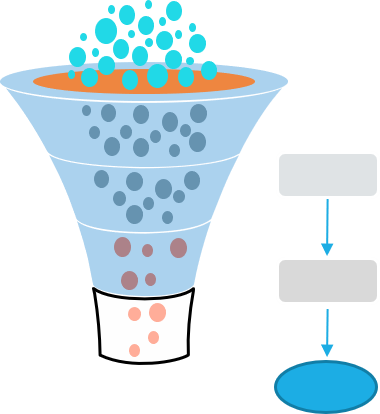

# Data-driven risk identification for decision-making
This analysis pipeline is showing examples of hypothesis-based workflow design to address specific business priorities.The outcome of the analysis is a reproducible analysis workflow of context-specific decision prioritization.

